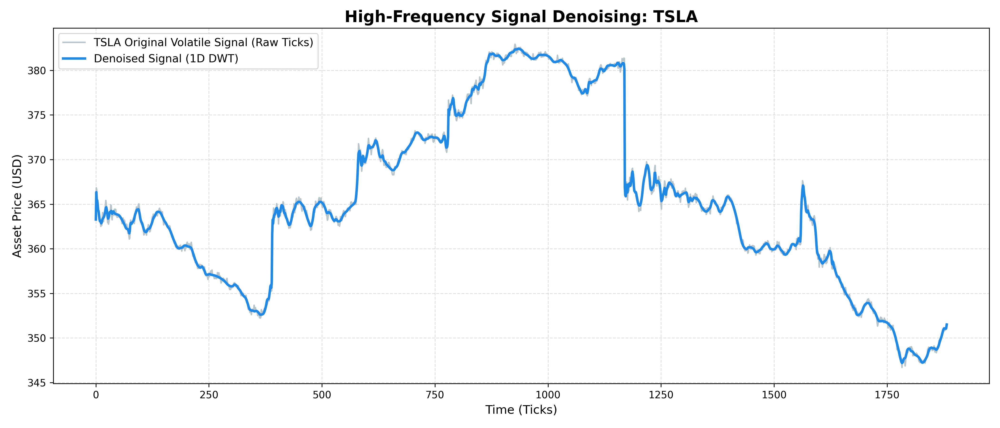

# High-Frequency Signal Denoising via 1D Wavelet Transforms


> **Project Overview:** A highly optimized Python engine that utilizes Discrete Wavelet Transforms (DWT) to strip high-frequency stochastic noise out of highly volatile 1D data streams, specifically financial tick data.



## 🧠 Academic Origin & Transferable Skills
This repository represents the direct translation of complex mathematical theories into a highly optimized quantitative finance tool. 

During my Master's thesis, my research focused on **Image Steganography**, where I utilized **2D Discrete Wavelet Transforms (DWT)** to decompose image matrices into spatial frequency sub-bands ($LL, LH, HL, HH$) for hidden data embedding. 

This project repurposes that exact mathematical foundation for a completely different domain. By transitioning the geometry from a 2D matrix to a 1D time-series array, this tool uses **1D DWT** to decompose a high-frequency asset price stream into:
*   **Approximation Coefficients ($cA$):** The low-frequency macro trend of the asset.
*   **Detail Coefficients ($cD$):** The high-frequency micro-volatility and stochastic noise.

By applying **Universal Soft Thresholding** derived via Median Absolute Deviation (MAD) to the Detail Coefficients, isolated noise singularities are mathematically filtered out. An Inverse DWT is then applied to reconstruct a clean, tradable signal without introducing the severe lag inherent to standard moving averages (SMAs/EMAs).

## 🗂 Project Architecture
```text
high-frequency-denoising/
├── assets/
│   └── denoising_plot.png      # Visual output
├── src/
│   ├── data_loader.py          # yfinance API integration & data handling
│   └── wavelets.py             # Core DWT mathematics & thresholding algorithms
├── main.py                     # Execution script
├── requirements.txt            # Dependency management
└── README.md

